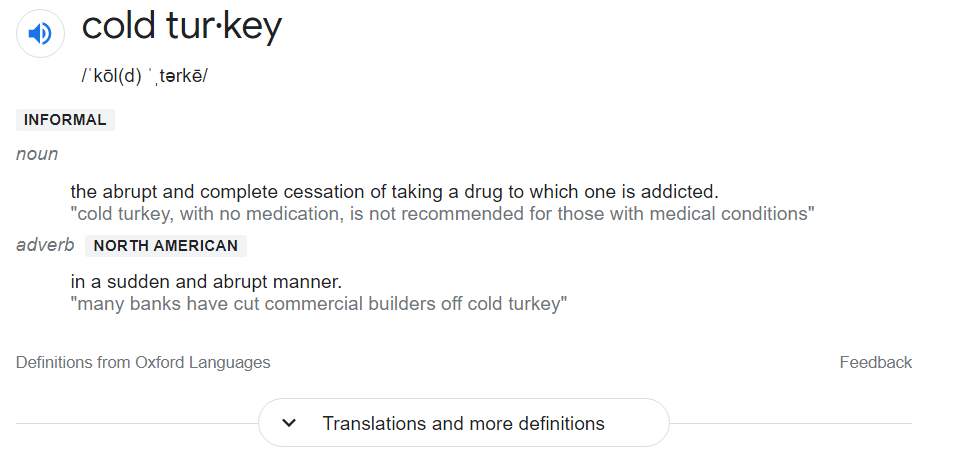

TV, Games, the incessant need to distract ourselves.

When I started this experiment I had gone two years of binge watching shows on my downtime. Its COVID, there is nothing else to do, I said.

I started, it sucked. It was dreadful. I had a lot of time, and nothing to do with it. I would lie on the couch wanting to watch something but knowing I couldn't. Then as the days went by, I would test things out. 

I started trying new things that I wouldn't normally do because I needed to fill the time. I started reading books, I started bothering friends and family and calling them more. I naturally started to fill my time with things I wanted to do.

Ever since I started, its been roughly 18 days and I don't want to go back. I've made a <a href="http://www.invision-inc.com">website</a> for a friend, I've read a few books, The Battle of Dieppe, The Wanderer, made a blog, learned enough to pass the AWS Architect Associate, and partly the AWS SAP certificates, learned about different serverless automation deployments, learned a lot about computer networks.

All that was in two weeks. Imagine what I could have done in two years. I'm being a bit hard on myself here. During those two years I still would create things like <a href="https://www.yokd.ca" >YOKD Personal Training</a>, but the speed and energy required would be way higher then it is now.

When you 'drown' yourself in unworthy dopamine triggers you feel like EVERYTHING else takes a ton of energy to do. Everything else unless its necessary like work, is that much harder to do. 

Just one more hour, I need it Tyler, trust me I need it. I've been working all day, I deserve a break. "Takes away the phone", give it back! Every 5 seconds being triggered to grab it after I take it away.

I bet you can't go 5 minutes without "being connected", to your phone and games. People who say we haven't been integrated with technology and we need to wait for Elon Musks neural link are wrong. We have been trained to not be able to go without it or we get cranky.

It's a bit difficult to go "cold turkey". 

There are practical techniques in life that really do help though. Like I think, its easier to go completely cold turkey then say I'll just do it once, or a couple times. If the goal is to "have the discipline" to remove things or add things from our life, I've read and experienced that its BEST for an all or nothing approach. 

Avoid the triggers that cause it. Put yourself in situations where you wouldn't get triggered. Because every time you get a trigger to do it, well it requires you to make the right choice. 'Cognitive Dissonance', which requires a high strength of will. We are all human and not perfect beings, so how can any one of us succeed? Avoid the triggers as much as needed. Set a firm goal and intention for yourself at the start of each day.

Again I'm not perfect, I'm aware of my flaws. I bite my nails, have been for quite some time. Whenever I get anxious or think, I would typically get triggered to do it. 

So I'll say here that my next experiment will be to do everything in my power to get rid of it.

## Implementing Discipline / Planning to remove a habit

Anxiety/Thinking is a hard thing to avoid getting triggers for. Which is why its been a tough one to crack for me.

So let's approach it like you would whatever you want to change in your life.

### Practical steps to implement:
- Go Cold Turkey
- Set a timeline of 21 days (time it takes to develop or remove habits), separate it into days and keep track. Start over if you fail. (you can add some negative reinforcement here if you like, I personally don't like too.)

- Avoid Triggers
- When you do get triggered, have the intention to avoid it.
- If it still fails, have a safeguard.

That means no nail biting, at all for 21 days.

I'll split it up into one day at a time. Even 1 hour at a time, or 1 minute if needed.

### TANGENT ASIDE ON DAVID BLAINE - A LEGENDARY EXPERIMENTER

He did a <a href="https://www.youtube.com/watch?v=XFnGhrC_3Gs">Ted Talk</a> on how he held his breath for 17 minutes and set the world record.

Essentially he separated those 17 minutes into the smallest sub sections he could. Every additional 10 seconds he would consider that a success. He would count 1,2,3...10, Then reset to 1. Then those 10 seconds built into 17 minutes. Keep in mind he did a lot of other things to train for this, and get his body in shape, but from a "Will" perspective this technique helped him quite a bit.

The next thing I need to do is avoid triggers. Its a difficult one to avoid anxiety or thinking. The more I can avoid them the easier time it will be, the more successful my experiment will be. Since I don't have to rely on will, and me making the right choice.

The thing is you shouldn't avoid all the triggers. Just some to make it manageable. 

### TANGENT ON WHY WE NEED TO TEST OUR DEFENSE TO STRENGTHEN IT
Nassim Taleb wrote a book on this: <a target="_blank" href="https://www.amazon.ca/Antifragile-Things-That-Gain-Disorder/dp/0812979680/ref=sr_1_1?crid=3NAQZELDE7VO7&amp;keywords=nassim+taleb+antifragile&amp;qid=1644606215&amp;sprefix=nassim+taleb+anti%252Caps%252C84&amp;sr=8-1&_encoding=UTF8&tag=lettersfro0d3-20&linkCode=ur2&linkId=8e5a6ca25f7b7487de78ceb4737d9b0d&camp=15121&creative=330641">Anti Fragile</a>

Fragile systems are those that have had no faults. That have't had the need to react to any threats. You can call them perfect systems since they have had no failures or faults, but systems naturally grow from them. Imagine when they have a fault, it'll be their first time reacting to one, and it should be a disaster.

So that was a bit abstract, essentially it means when we are making our strategy for losing or gaining a habit, we need to stress test it. We need to either purposefully trigger it, or naturally have triggers. 

## Creating A Plan

Relating it to nail biting, I'll write it as one of my intentions to maintain throughout the day. Just have a piece of paper that I read when I wake up. This is to strengthen my will for each purpose to make it easier for me when I need to enact it.

Then I'll use the unpleasant tasting nail polish as a last defense/resort. 

I believe if I still bite my nails after all these defenses then I'll need to really find ways to reduce anxiety, and thinking. Perhaps re-implement meditation into my daily routine.

But again, hopefully from this example you can learn to make a plan for your own habit. It isn't just going cold turkey, or having the discipline to stop.

You need to make a plan, and if it fails don't be hard on yourself, failing makes you stronger the next time you try again. Reflect on what caused you to fail. Was it the situation you put yourself in, was it you forgot to do something and need to be more diligent next time? Don't hate the player, hate the game. Meaning you didn't do anything wrong, it was the system you had in place, something went wrong. Avoid the ego hit here, and focus on success. 

When you go to the gym, and you aren't getting results, even if you are doing everything right, you should change your way of thinking to each time you go to the gym is a success. You know that is all you need to do. Just go, each time you go, you win/succeeded. The muscles will come.

If you pick a specific time each day to do something then you're more likely to do it, so incorporate that into your plan as well.

## Outro

My experiment to remove unworthy dopamine triggers was a success, and I think I'll keep including it into my life. Again I'll experiment and look at trying to incorporate movies and other easy entertainment back in. It should be a healthy balance. It will take a plan to transition back, in a future post I'll outline that plan.

This has been a letter from a coder.

Best Regards,
Tyler Farkas