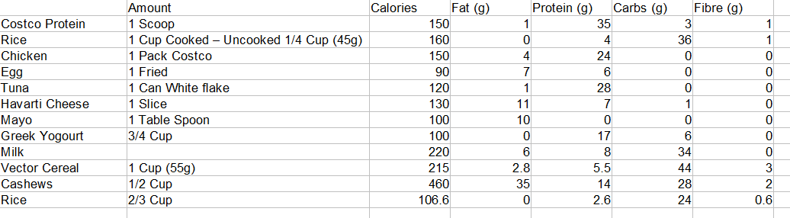
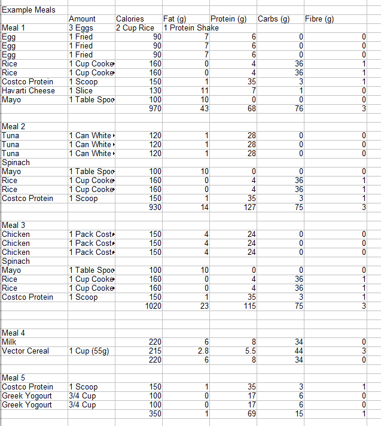

I've been working out for 8+ years now. I'm at an intermediate level. Squat 2 plates 10 pounds, bench 2 plates 15 pounds, and dead lift 3 plates on each side. 

All that was due to the way I was dieting and a little to the way I was working out. 

I did an experiment where I would have 6 meals a day. I split my total calorie goal into 6 meals. A protein rich meal when I wake up, and when I go to bed. You would set a total calorie limit. I was bulking so you would take your weight and do 16-18 x you body weight in calories. Then you would split it, 40% protein, 30% fat and carbs.

For example when I started I weighed 185 pounds. Then over 10 weeks of doing this I weighed 228 pounds. Almost 45 pounds thats pretty insane. (Be warned, I did put on a decent amount of weight, next time I'll add more cardio ;).)

## The Diet Plan: 
Total Calories: 16 * 185 = 2960
Protein (4 calories per gram), 40% = 2960 * 0.4/4 = 296 grams of protein per day
Fat (9 calories per gram), 30% = 2960 * 0.3/9 = 98.7 grams of fat
Carbs (4 calories per gram), 30% = 2960 * 0.3/4 = 222 grams of carbs

We've all been there, having these calorie goals, and the difficulty to implement them. I'm fairly lazy so what I like to do is make a list of the calories of each food I like, then use that to make meal combinations that hit the calorie goals. 

I would take those and use them as building blocks, then copy and paste them to make meals that I can have during the day.

This way all the work is done ahead of time, and I don't have to think. Kind of like pre-processing data and caching it. 

I'd make some rice for having throughout the day, then the rest of the food was pre-made. Everyone says counting calories is difficult. If you do it like this it isn't. To the people who input everything into my fitness pal each time, kudos to you. Plus doing it this way, all the calories are accounted for.

## The Workout Plan: 

I'd workout 3 times a week only. In the future I'd add cardio every other day, or at least 3 times having one full rest day. 

The plan was simple, use the snowball method.

2 warmups
4-5 Main sets
1 warm down with a superset.

Insert your favorite exercises and you'll be good.

The first day was Chest, Shoulders, Traps, Abs.
The second day was Legs, Abs.
The third day was Back, and Biceps.

Thats all you needed to do, 3 days a week. Super simple, and works for all levels.

The idea was from a pdf "Secrets to Building Muscle Mass by Anthony Ellis", but its based on the concept that your body needs nutrition at all times for maximum growth. If it goes for an hour without the nutrition it needs then it needs to take it from somewhere.

Best Regards,
Tyler Farkas
