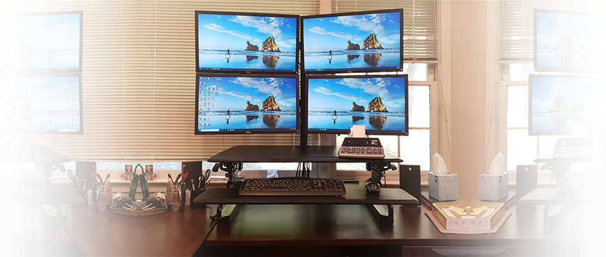
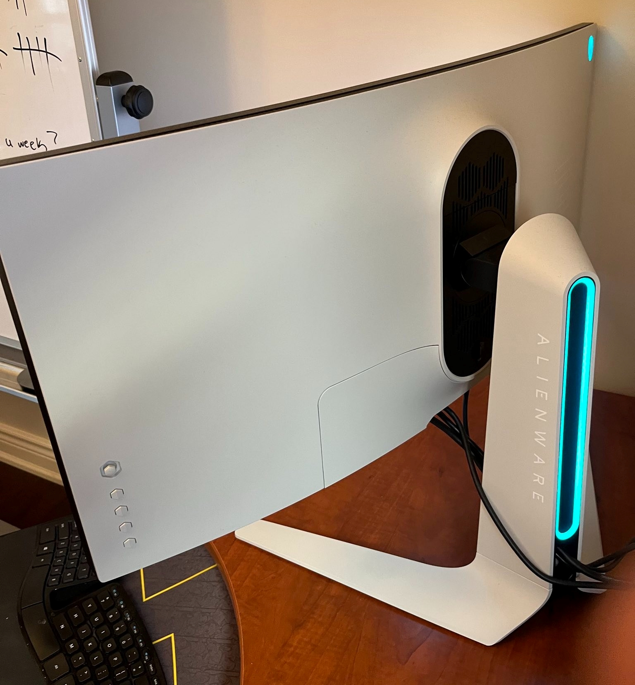
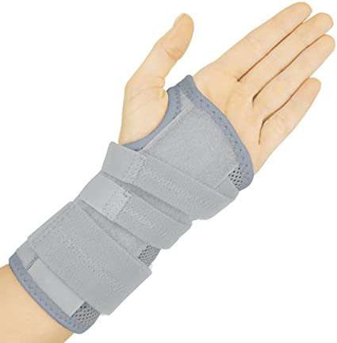

A year or two ago I started noticing problems in my neck, stiffness in my finger tips, and toes. Pain in my wrists. 

I used to think that I was young and could do whatever I wanted. Ergonomic rules didn't apply to me. It caught up to me quick. Especially when you're setup is really bad. I had a setup like this:

After I noticed these problems I did a ton of research, got an appointment with a professional ergonomic instructor and learned what it took to make an ergonomic setup.

The most important point is to <b>Limit Movement</b> in problem areas.

## Limit Movement of your Neck
Every degree up or down, left or right your neck moves is equivalent of 15 pounds of weight being put on it. The neck is a very important muscle, a ton of information moving up and down it at all times. 

Now you can imagine that amount of weight, continuously will put pressure on any muscle to fail. We are a generation where all we do is look and work on a computer, and we need to adapt. 

Lets look at that example above again. With those 4 monitors you would be looking left and right, up and down. Your eye level isn't even at the top of the monitor so you can see all the information. Constantly moving your neck is running a marathon, and its begging you to stop. When I see people with more then 2 monitors I feel bad for their necks, and verbally say ouch.

Even two monitors gets excessive, but if you position them so that you are in the middle of the two then it could be alright. My ideal is having one Ultrawide monitor. Its very easy to <b>place yourself in the middle of it, position the top of the monitor to your eye level, and see the maximum amount of information without having to move your neck.</b> Even when words go to the edge of the page you can still see it without having to move. 

Buying <a href="https://amzn.to/3oI14L2">this</a> monitor was the greatest reason my neck pain stopped. A cheaper alternative is from <a href="https://amzn.to/3oHUvZ3">dell</a>. 

But Tyler, with an Ultrawide screen monitor I can't have all my tabs open! 
Most operating systems these days have the feature where you can split the screen up into different sections. This works wonders. 

The one thing I noticed while using an Ultrawide monitor is when sharing my screen on meetings people have a difficult time seeing text because the resolution is so large. I typically zoom in to combat this so it isn't too bad. If you know a better way, let me know in the comment section.

If it saves my neck then I'm all for it.

Another factor is that they are cool, and light up. That isn't needed from a functional perspective though.

## Limit Movement of your Wrists, and Inward pointing shoulders
If you're trying to avoid having to wear one of these beauties every night:

I suggest the following items dedicated to limiting wrist movement. A <a href="https://amzn.to/3gLqlQ0">Vertical Mouse</a> and a <a href="https://amzn.to/3gGZLrs">Winged Keyboard</a>. These are the ones I use.

### Verticle Mouse, Wrist pain avoidance
Normal mouses are the typical, they are great for precision. The issue with them is they sway your wrist left and right. Vertical mouses stop your wrist from moving at all. For example: The bones and muscles in your wrist are much smaller then the ones in your arm. When you use a vertical mouse you move with your whole arm rather then your wrist. I don't recommend playing a first person shooter with them, but when coding it is more then you need. It will be an odd feeling at first using it, but you get used to it. Then after a week, try going back to a normal mouse and it will feel funny. 

### Inward Shoulder Avoidance
Winged Keyboards are better because they avoid your shoulders pointing inward. Inward pointing shoulders lead to back and shoulder problems. There are keyboards that are two halves of a whole, which is really hackeresque and kudos if you can use them, but I feel like you need to consciously use them the right way or else they can be just as bad. The one I recommended above is a good option, reasonably priced, does the job where you don't consciously have to pay attention to it.

## Take a break every 45 minutes
This is a tough one. When you're in the mojo, feeling the flow in a good coding session, the last thing you want to do is interrupt it. When we do those long sessions we don't pay attention to anything. If we reset every now and then, we'll be more aware. Each time when starting to be in the best posture. I used an App to remind me to get up, I would go get some more tea during those times. It wasn't much of a hindrance and I felt better. Got less headaches because of it. 

## Proper Posture
Posture, the most loved topic. So difficult to implement since it takes conscious effort. Thats why I believe in good equipment. It does the work for you. I have a Herman Miller Embody, the Aeron was the model before that was good. You can go to their website <a href="https://www.hermanmiller.com/">here</a> to learn more. These are definitely the best of the best and pricey because of it. There are models in the $500 range that you could find. You need to find a chair that suits your body type or is customizable enough. You got to be careful, try sitting in the chair fully to the back of it. You should comfortably be able to put your feet on the ground. The other important point is providing enough support for your back.

Best of luck in crafting your own setup, take a picture and share it with me below.

This has been a letter from a coder.

Best Regards,
Tyler Farkas