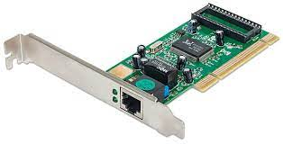

## Why bother learning these components at all?
My reason to learn is straightforward. Recently I decided to learn more about how computer networks are created because I want to become a Solutions Architect (someone who designs complex computer systems). I ended up buying a Cisco Certificate Study manual textbook (one of the main providers of network equipment globally), and started reading a few pages. My eyes started to gloss over, and I realized I didn't absorb any of the content. Especially since those textbooks are <i>very</i> dry. 

I didn't have the foundation of knowledge that was needed to even read it. 

If I spent a good 10 minutes slowly reading one page. One line at a time, stopping and googling the words I don't understand, I would barely make progress.

What I decided to do was start with the basics, and build my way up. Every time I would learn one thing, I would go as deep as I could to learn the component. This way I'm building almost like a graph of connected ideas in my head, and slowly I'll be able to see the big picture.

The below is one of the first topics I looked at. Computer Networking Components. 

<b>I summarized each one, and tried to make a metaphor for you</b> so these topics can be easily digested and entertaining. You can use this post to look up other concepts that will be covered.

## Server
A computer that <b>"Serves"</b> data to computers who request it. Like the Barista at your favorite coffee shop, they take your order, make it, and serve it. Computer Servers typically give documents in HTML(what web pages are made of), or JSON data (like an excel or word document, just a format for describing text), or pictures etc.

## Client
Now the reason we have Servers, is typically, for Clients. Your Mac, or PC. Clients, request data from servers. Then they Work together with servers to create a "client/server network" or like at Starbucks you would work together to create a full Transaction.

## Network Interface Cards
Let's go a step deeper. Now you know when you try to connect to the internet with your computer? You are using a "Network Interface Card" They search for networks to connect to and facilitate that connection with a username and password. Either wireless or LAN (That blue wire you connect to your computer), these are built into most computers.

They look like this, not sure how they would fit in a phone. That'll be for another article.

## Home "Router"
You may or may not know what a router is, but you have a version of them in your house that you need to reset every now and then because the internet isn't working or is slow. Its the box that you connect wires too, and connect to the internet wirelessly. Routers are how we get internet connection to our computers. These have one WAN (Wireless Area Network) port, and 1 to Many LAN (Local Area Network) ports. Ports are the boxes at the black that wires go into. The WAN would be the one that connects to a modem which your Internet Service Provider(ISP) would give. (In Canada its Rogers or Bell(Go with bell if you can.)) The LANs are physical ways to connect computers to the router.

### So Why do we need them, and what's really going on?

Electricity runs through Routers from computers, communicating "packets or a small paragraph of text" of data to which then send it to the main internet, then it gets forwarded to the destination by commercial routers/switches with massive tables from your ISP.

## Commercial "Router"

Commercial Routers act on Layer 3. The network layer of the OSI model.(covered in another post) 

Routers in the main internet have MASSIVE dictionary like tables which are created using RIP, and BGP(you don't need to know this, but in another post we can go over it). They have a source IP, and destination IP address. 

Routers use whats called a MAC address to assign an IP address to a network component. The MAC is a number that is uniquely given to each Network equipment component. That way they know where to specifically forward the data too.

### IP Address:
A bunch of numbers separated by dots. We all agree to what these numbers mean. We use DNS(Domain Name Services) providers to tell us what they mean. They map www.tylerfarkas.ca to an IP address that tells your computer where to send and request its packets(data/text) from. 

## Modem
Connects your Router to the internet. Most modems only have one LAN ethernet port, which is why Routers are used(they can have many). Your Internet service provider, gives you an ethernet connection that comes from a Modem.

Going deeper, a modem stands for "Modulator/Demodulator" which converts digital signal into an analog signal. Modems talk to other modems They modulate data over the physical cables converting '1s and 0s' into <b>electricity</b>, then the other modem demodulates for the switches/routers to understand back in '1s and 0s'. Truly truly fascinating stuff.

Lets go even DEEPER. Modems can receive and transmit data at different frequencies all happening at different "clock cycles". Humans use seconds for time, computers use clock cycles. Since electricity is half the speed of light, clock cycles are pretty fast. Each second you can do something, each clock cycle a computer can do something and differentiate that something. 

TANGENT ON CLOCK CYCLES:

-> Conventional CPUs are built from a chain of sequential logic. 1+1=2. or In order to drive, you need to study, do a test, pass it, get your license, and get a car. Its sequential, otherwise it would be chaotic.

Things need to go in order. Using electricity is tricky.
-> Electronics use clock cycles to synchronize data. 
-> Clock cycles ensure that no part of the circuit continues before the results of the previous section have settled to a stable value ensuring sequential ordering. 

## Hub
A Hub is a box which accepts many of the blue wires (ex. CAT5 wire). Hubs receive data from one network and transmit it to all the nodes(the ones connected with blue wire) in the network. Nodes then check if its their piece of data. <b>Seems like a brute force algorithm.</b> Just took a cute photo of my dog, quick MUST SEND TO EVERYONE! It isn't the best option because no thought is used, which is why they are rarely used now.

## Switch (Switching hub, Bridging hub, MAC bridge)
Like a hub, except it intelligently sends packets to where they should go. Checks the packets source MAC(which IP address and networking component it came from), if its not in the switches table it will add the MAC, and port (for future lookups so it knows what network data goes through it). It also checks the destinations MAC address compares it. When it doesn't have a matching MAC, it acts like a hub, and uses whats called <b>Flooding. (Unknown Unicast Flooding)</b>
 Sends the frame out to all its physical ports.  
Slowly it creates a switch table filled with MAC addresses and physical port numbers by using the Flooding technique. The MAC address tells which device it came from, and the port matches it to the physical port on the device itself.  Like <b>each black square in a switch will have a number associated with it called the physical port.</b> This goes for majority of networking equipment, just the way of the land.

The table is used to shrink the collision domain of traffic. (Multiple people want to use the same door at a time, and it can only fit one, what do you do?) When a switch doesn't know where to go, it performs a flood, increasing the collision domain. If this happens frequently then the network becomes unusable.

Switches use CAM memory - Content Addressable Memory. Like RAM except better. It uses specialized search techniques and binary results. Switches have massive amounts of CAM to avoid flooding.

## Repeater
A device that re-transmits signals that go over a long distance. As the signal gets weak it copies it and re-transmits it. Usually used for distances of up to 100 meters. 

## Bridges
Layer 2. Data Link. Connect two or more LANs using the same protocol together. Essentially creates one big network from them. <b>"Network Bridging"</b>. If you think of Routing, differentiating packets by each component of the network, bridging is the opposite. Makes all the networks one. If one or more of the bridged networks is wireless then its called a "Wireless Bridge"

## Gateway

Gateways are hardware devices that controls the flow of traffic into a network. It accepts most protocols and converts it into one thats usable within the network.

Lets say at home you speak <b>ONLY</b> english, and you have a gate to your house. Lets say this gate is a "Smart" gate, when people speak into it, <b>NO MATTER the language</b> it will convert it to english just so you can understand it. Thats what a gateway is for networks. It is located at the edge of the network and allows your network to communicate with all others. No matter the protocol used it will convert it to the one your network uses. Smart huh.

Thanks for reading. 

Please like, share, comment and subscribe if you found this helpful.

Best Regards,
Tyler Farkas