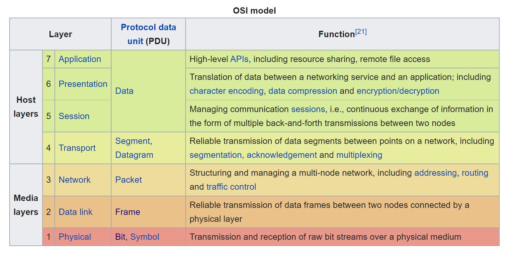

# OSI (Open Systems Interconnection) Model

## Why the OSI Model was created
We have the luxury of not having to create how physical networks work.

Before the internet was created it was chaos. Companies had their own internet. They were individual networks. There was no such thing as combining or communicating from different networks. 

Then people started to create ways of communicating. There were so many different ways. Each thinking that some things were needed while some weren't. 

Imagine the inefficiencies of this. Not being able to communicate with your friends or family, using google to search for something.

## What the OSI Model Is
Standards started to be created which was the OSI model. It goes through all the different parts of creating a network, and created consistency on what everyone agreed was needed. 

## Why learn the OSI Model?
To be clear the OSI Model isn't used in the internet. TCP/IP is generally used and accepted. TCP/IP is based off the OSI Model. 

So why learn it? Well its part of the language to speak as Network Architects do. When are you diagnosing problems with the network you can say its a layer 1 issue, or a layer 7 issue.

Again this is what I've read from a collection of multiple sources.

## The 7 Layers of the OSI Model
It's pretty intuitive so don't worry about the amount of layers.

An easy way to remember the layers: 
All People Seem To Need Data Processing.
Application
Presentation
Session
Transport
Network
Data Link
Physical

### Application - Layer 7
It all starts with the part of the network that "Users" interact with. You use your computer to go to a website. Your phone apps. The network needs something to start the interaction, and somewhere to end it as well.
- Typically HTTP

### Presentation or sometimes called Syntax - Layer 6
-> Encrypting(securing it so it can't be read) Data, Decrypting(removing the security from encrypting).
-> Compressing Data sent - how would you make this smaller? aaaabbbb -> 4a4b
-> Performs Serialization on Data. - Takes a complex object, converts it to bytes to be sent in the network. (which is just 1s and 0s, and electricity.)

Examples: SSL (Secure Socket Layer), AFP(Apple Filing Protocol for macOS.), LPP(for on top of TCP/IP.)

### Session - Layer 5
- In modern applications this layer is either included in the Application level layer, and at the Transport Layer. Its good to understand that these functions are needed for a network.

- Establishes, Manages, and terminates the session that computers use to talk to each other. The Session layer includes authentication(username and password), authorization (token used just for you after you authenticate) and reconnects.

### Transport - Layer 4
At this layer it transfers the data to a destination, while maintaining quality. This means, a consistent connection between two network components or a connection from one to many.

Examples include TCP, and UDP. In short TCP is secure and is a server to client relationship. UDP is a peer to peer relationship and is less worried about data faults, and just retries. Think of classic web browsing as TCP, and downloading a Torrent (LimeWire etc.) file as UDP.

#### Connection oriented Communication
Converting the data to a data stream for easier communication between computers. Easier division of data into packets, typically bytes.

#### Reliability
Computers use different tools to ensure reliability at this layer. Checksum can be used. (Add up all the bits before and after sending, do they match?). Ack, or Nack message to a sender from the server depending on if everything looks good. Automatic Repeat Request is another example, it uses Ack, Nack, and timing to automatically send the data again. 

#### Flow Control
Tells the sender how much data/ how fast to send so the computer thats receiving the data won't be overwhelmed.

#### Multiplexing
If there are multiple senders of data, only one message can be transmitted at a time. Multiplexing organizes all the senders so that one by one they can send, and all the data can be transferred accurately.

### Network - Layer 3
Responsible for taking the data from the transport layer, putting them into packets. Then routing the packets to the destination using Commercial Routers and Switches. 
Transfer "packets" from one node to another in different networks.

Nodes have an address, nodes provide a message and a destination, then the network finds the best route to deliver it. 

Routing is the process of selecting a path for traffic in a network or between or across multiple networks.

Example Protocols at this layer: IPSec, Internet Protocol (IPv4, IPv6). A few routing protocols such as RIP, OSPF(Open Shortest Path First), and EIGRP. 

### Data Link - Layer 2
Concerned with local delivery of frames between nodes on the same level of the network.

Lets uncouple that. 
- Frames are versions of packets that get sent via the physical layer.
- Nodes are switches, and commercial routers.

Routing takes place in the Network/previous layer, but Frames are sent as far as possible on each Network to get to the destination.

The Data Link layer is like a neighborhood local traffic cop. 

Making sure traffic through a local network is secure who's turn is it to go, what to happen when collisions occur, limit collisions etc. 

### Physical - Layer 1
Transmission and reception of raw bit streams over a physical medium (copper or fibre optic wires)
Bluetooth, USB, Ethernet, Wireless

## Outro

That's it, all the 7 layers of the OSI model. As you transfer data from one computer to another it goes through all these layers, more specifically functionality.

We need to batch the data to be transmitted through packets, each packet needs to know where its going, and how to get there. Then needs to be used by the applications that run the internet. 

This was an overview, in future posts I'll go over the actual protocols in more detail!

Best Regards,
Tyler Farkas