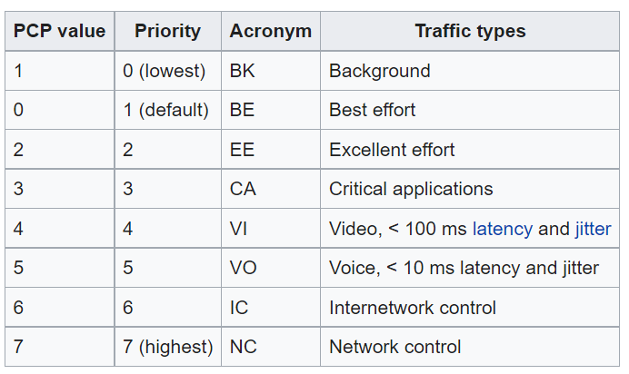

## The Data Link Layer. Buckle Up we're in for a ride!

Lets get into the details of packet forwarding. How data from Layer 2 gets sent back and forth. If you haven't already read the prior two networking posts about the OSI model, and network terminology going forward it might be more difficult to follow along.

MAC Address is used for layer 2 forwarding. Components on the local network will listen for packets with a destination MAC address as its own. 

## What is a MAC address?

Its a Network device/equipments address. Your house has an address, so does the equipment in local networks.

A MAC address is a 48 bit address, split across 6 octets (8 bits, or a byte.) and notated in hexadecimal (made up of 16 symbols, normal decimals 1-10, and A-F).
(This is because each hexadecimal value can be represented with 4 bits)

An example of a MAC address would look like: FF:FF:FF:FF:FF:FF

That specific MAC address is known as a Network Broadcast, and sends messages to all network components.

How a MAC Address is created: 
FF:FF:FF - Assigned to a device manufacturer, known as the OUI. (Organizationally Unique Identifier)
FF:FF:FF - The last three octets must be unique and given by the manufacturer.

A Networking device listens for network traffic that contains its MAC Address as the destination MAC address.

## Tangent on how network traffic on your local network works:

Network components send and receive data through ports. Back and forth they go.

If you'd like to see what's going on in your own network, feel free to download <a href="https://www.wireshark.org/download.html">Wireshark</a>. 

Wireshark is a packet sniffer. It has a creepy name, thats because it does creepy things. 

It allows you to see what people on your network are sending!

Everything that gets sent to your network equipments MAC address can be seen.

Before the world of HTTPS, there was HTTP, you can see exactly what people were sending. Decrypted data. 

Now with HTTPS, if you use a packet sniffer, you can still see things, you are not secure fully. You can see the DNS lookups, and names of all the sites that people are going to on the network.

To be fully safe you need to use a VPN at least, and possibly TOR which is a random network routing tool, which is why there was so much talk going on about it.

Thats why they say when you're using public Wifi, you really need to be careful what you're using it for, because if you're sitting at a Tim Hortons, and someone is using Wireshark, and you login to some website, they'll be able to see your username and password if you're not careful.

## What if you have confidential data, use a Virtual LAN (VLAN).

As I was saying, all traffic goes to a Destination MAC address (Network device), to a physical port in the device (a black box where typically blue wires go into).

If you wanted to separate the traffic so that people on your network couldn't use a packet sniffer, you could use a VLAN.

A Virtual LAN is what it sounds like. Its a virtual/software component that goes on top of the physical network device. 

It allows you to assign Multiple Broadcast Domains on the same Switch. 

If you have the Accounting Division, Finance, Technology, etc. They all have data that shouldn't necessarily be shared.

You can use a VLAN to separate each computer to a specific divisions VLAN. All traffic from those computers will go through the specified ports for that VLAN.

Based on the 802.1Q standard, the VLAN packet structure is based on 32 bits.

## 802.1Q VLAN Packet Structure

A <b>VLAN header or 802.1Q tag</b> is added to each packet to decide which VLAN/Port the traffic should go to. Besides the regular Destination MAC, Source MAC, Destination IP, Source IP, and Payload.

### TPID - Tag Protocol Identifier - 16 bits
These 16 bits are a hardcoded value -> 0x8100 to specify that it is a IEEE 802.1Q packet.

### PCP - Priority Code Point - 3 bits
Specifies the priority of the traffic of the packet. Its used by QoS(Quality of Service) disciplines to differentiate traffic. This is used at the Data link layer. 

### DEI - Drop Eligible Indicator - 1 bit
Can this packet be dropped if it needs to be? Yes or No. 1 or 0.

### VLAN ID - Identifier for the VLAN - 12 bits
Specifies the VLAN associated with a network packet.
-> Provides 4094 Unique VLANs in the network. 

Catalyst VLAN Switch Logic:
-> 0 is reserved for 802.1P traffic.
-> 1 is the default VLAN. 
-> 1002-1005 are reserved.
these cannot be changed.

-> 2-1001, you can add VLANs with these IDs as necessary for your network.
-> 1006 - 4094 are in the additional VLAN range as well.

An access port is assigned to only one VLAN. 
Trunk ports can carry multiple VLANs. 

All the new Virtualization software leverages trunk ports. Once the traffic is sent to the appropriate VLAN the VLAN header is removed from the packet.

Any traffic sent to a port without the 802.1Q tag or VLAN header, goes to the default/native VLAN: 1.

Industry standard is to set the native VLAN to something other then 1, that has no hosts attached to it. 

This is because all switch control plane traffic is advertised using VLAN 1.
-> Switch control plane traffic -> Handles all routing protocol control traffic. Ex. BGP(Border Gateway Protocol), and OSPF (Open Shortest Path First Protocol).

That could be a significant number of requests going through which could cause network congestion.
